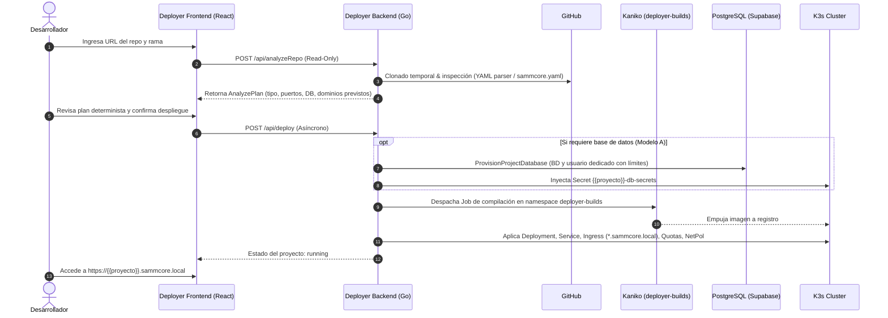

# 📄 Visión del Producto – SAMMCORE Deployer

## 1. 🎯 ¿Qué es el SAMMCORE Deployer?
El **SAMMCORE Deployer** es el orquestador central de despliegues para el ecosistema **SAMMCORE**. Su función principal es transformar código fuente alojado en repositorios de GitHub en aplicaciones operativas, aisladas y monitoreadas dentro del clúster de Kubernetes ligero (**K3s**), sin requerir que los desarrolladores redacten manifiestos manuales ni gestionen infraestructura compleja.

A diferencia de las aplicaciones comunes que son creadas y administradas por el propio deployer, el **SAMMCORE Deployer es un servicio fundacional**: reside en su propio namespace (`deployer`), se construye y despliega mediante su propio pipeline de CI/CD, y cuenta con permisos controlados para gestionar el ciclo de vida de los proyectos.

---

## 2. 👥 Usuarios Objetivo
1. **Desarrolladores Internos:** Necesitan publicar microservicios, APIs y sitios web rápidamente en la red local (`*.sammcore.local`) para pruebas o entornos productivos.
2. **Administrador de Infraestructura:** Requiere que cada proyecto esté contenido en su propio `Namespace`, gobernado por cuotas de CPU/RAM, monitoreado por Prometheus/Grafana y con bases de datos aisladas en la plataforma central de datos.

---

## 3. 🔄 Flujo de Trabajo del Usuario (Workflow)



---

## 4. 🧩 Arquetipos de Proyectos Soportados
El Deployer clasifica y gestiona tres naturalezas de proyectos:

1. **Stack Multi-Servicio (`compose`):**
   - Repositorios con `docker-compose.yml` o `compose.yaml` que contienen frontend web y backend API (ej. `backroom`).
   - Si declaran un servicio de base de datos (`postgres`, `mysql`), este se sustituye automáticamente por una base lógica dedicada en el clúster central de **Supabase PostgreSQL (Modelo A)**.
   - **Enrutamiento compatible con Wildcard TLS (`*.sammcore.local`):**  
     Dado que los certificados wildcard TLS estándar cubren un único nivel de subdominio (`*.sammcore.local`), el enrutamiento se define estrictamente como:
     - **Web UI:** `https://<proyecto>.sammcore.local`
     - **Backend API:** `https://<proyecto>-api.sammcore.local` (o subpath proxy `https://<proyecto>.sammcore.local/api/`).
2. **Microservicio Individual (`dockerfile`):**
   - Repositorios con un único `Dockerfile` (Go, Node.js, Python, Rust).
   - Genera un `Deployment`, un `Service` ClusterIP y un `Ingress` bajo `https://<proyecto>.sammcore.local`.
   - Si requiere base de datos, se aprovisiona bajo demanda en Supabase.
3. **Sitios Web Estáticos (`static`):**
   - Repositorios basados en HTML/JS puro que publican su directorio `dist`/`public` mediante un servidor NGINX optimizado.

---

## 5. 📄 Contrato Declarativo de Aplicación: `sammcore.yaml`

Para garantizar predictibilidad y evitar depender de heurísticas ambiguas, un repositorio puede incluir opcionalmente en su raíz un archivo `sammcore.yaml` (o `sammcore.yml`) que actúa como **fuente de verdad determinista**, con precedencia absoluta sobre el análisis automático.

### Esquema y Especificación:
```yaml
version: "1"
name: backroom
type: compose # compose | dockerfile | static
database:
  required: true
  type: postgres # Modelo A central
services:
  web:
    port: 80
    subdomain: backroom
    healthCheck: /
  api:
    port: 8000
    subdomain: backroom-api
    healthCheck: /health
env:
  VITE_API_BASE: "https://backroom-api.sammcore.local"
```

### Reglas de Validación Normativas:
* **`name`:** Minúsculas alfanuméricas y guiones (`[a-z0-9-]+`), longitud entre 3 y 35 caracteres.
* **Prohibición de Colisiones:** No puede terminar en `-api` ni en `-docs` (para evitar solapamientos con los subdominios de nivel único).
* **Nombres Reservados Prohibidos:** Se rechazan nombres que inicien con `kube-` o coincidan con infra (`deployer`, `supabase`, `ingress-nginx`, `monitoring`, `grafana`, `traefik`, `portainer`, `api`, `docs`, `admin`).
* **Puertos:** Rangos válidos de contenedor entre 1 y 65535.
* **Subdominios:** Deben ser compatibles con el wildcard de un solo nivel (`*.sammcore.local`).

---

## 6. 🔨 Motor de Construcción In-Cluster: Kaniko

Todas las aplicaciones que requieran compilación de imágenes Docker dentro del clúster se procesan mediante **Kaniko** ejecutándose exclusivamente dentro del namespace aislado `deployer-builds`.
* **Seguridad sin Docker-in-Docker:** Kaniko compila en espacio de usuario sin exponer el socket `docker.sock` del host.
* **Aislamiento de Recursos:** El namespace `deployer-builds` cuenta con su propio `ResourceQuota` y `NetworkPolicy` para que los picos de compilación nunca degraden los servicios de producción ni las cuotas de las aplicaciones cliente.

---

## 7. 🛡️ Principios No Negociables
* **Cero Contraseñas en Repositorio:** Toda credencial se genera criptográficamente en memoria y se inyecta directamente como `Secret` de Kubernetes.
* **Persistencia Centralizada (Modelo A):** No se levantan contenedores de base de datos dispersos por proyecto. Se utiliza la instancia horizontal de Supabase con almacenamiento NVMe persistente.
* **Enrutamiento Dinámico de Nivel Único:** Se utilizan subdominios compatibles con el wildcard TLS `*.sammcore.local` (`<proyecto>.sammcore.local` y `<proyecto>-api.sammcore.local`).
* **Análisis No Persistente:** La inspección de repositorios (`POST /api/analyzeRepo`) es estrictamente de sólo lectura y devuelve un plan de despliegue sin modificar `history.json` ni reiniciar aplicaciones en ejecución.
