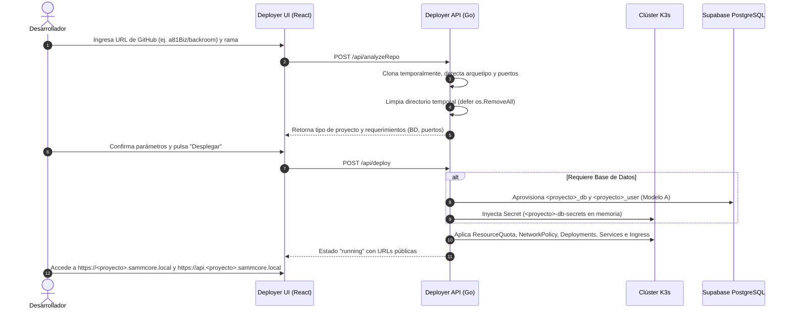

# 📄 Visión del Producto – SAMMCORE Deployer

## 1. 🎯 ¿Qué es el SAMMCORE Deployer?
El **SAMMCORE Deployer** es el orquestador central de despliegues para el ecosistema **SAMMCORE**. Su función principal es transformar código fuente alojado en repositorios de GitHub en aplicaciones operativas, aisladas y monitoreadas dentro del clúster de Kubernetes ligero (**K3s**), sin requerir que los desarrolladores redacten manifiestos manuales ni gestionen infraestructura compleja.

A diferencia de las aplicaciones comunes que son creadas y administradas por el propio deployer, el **SAMMCORE Deployer es un servicio fundacional**: reside en su propio namespace (`deployer`), se construye y despliega mediante su propio pipeline de CI/CD, y cuenta con permisos controlados para gestionar el ciclo de vida de los proyectos.

---

## 2. 👥 Usuarios Objetivo
1. **Desarrolladores Internos:** Necesitan publicar microservicios, APIs y sitios web rápidamente en la red local (`*.sammcore.local`) para pruebas o entornos productivos.
2. **Administrador de Infraestructura:** Requiere que cada proyecto esté contenido en su propio `Namespace`, gobernado por cuotas de CPU/RAM, monitoreado por Prometheus/Grafana y con bases de datos aisladas en la plataforma central de datos.

---

## 3. 🧩 Arquetipos de Proyectos Soportados
El Deployer clasifica y gestiona tres naturalezas de proyectos:

1. **Stack Multi-Servicio (`compose`):**
   - Repositorios con `docker-compose.yml` que contienen frontend web y backend API (ej. `backroom`).
   - Si declaran un servicio de base de datos (`postgres`, `mysql`), este se sustituye automáticamente por una base lógica dedicada en el clúster central de **Supabase PostgreSQL (Modelo A)**.
   - Enrutamiento dinámico multi-host: `https://<proyecto>.sammcore.local` para la interfaz web y `https://api.<proyecto>.sammcore.local` para la API REST.
2. **Microservicio Individual (`dockerfile`):**
   - Repositorios con un único `Dockerfile` (Go, Node.js, Python, Rust).
   - Genera un `Deployment`, un `Service` ClusterIP y un `Ingress` bajo `https://<proyecto>.sammcore.local`.
   - Si requiere base de datos, se aprovisiona bajo demanda en Supabase.
3. **Sitios Web Estáticos (`static`):**
   - Repositorios basados en HTML/JS o proyectos SPA (React, Vue) que publican su directorio `dist`/`public` mediante un servidor NGINX optimizado.

---

## 4. 🧭 Flujo de Trabajo del Usuario

---

## 5. 🛡️ Principios No Negociables
* **Cero Contraseñas en Repositorio:** Toda credencial se genera criptográficamente en memoria y se inyecta directamente como `Secret` de Kubernetes.
* **Persistencia Centralizada (Modelo A):** No se levantan contenedores de base de datos dispersos por proyecto. Se utiliza la instancia horizontal de Supabase con almacenamiento NVMe persistente.
* **Enrutamiento Dinámico Total:** El NGINX del host resuelve mediante wildcard `*.sammcore.local` hacia el Ingress Controller de K3s. Ningún despliegue nuevo requiere editar archivos en el host físico ni reiniciar servicios.
