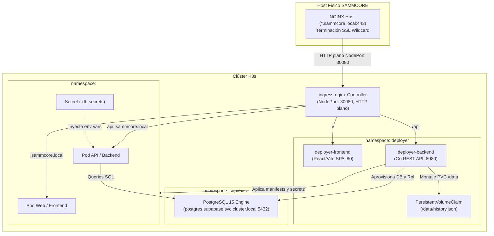

# 📄 Especificación Técnica – SAMMCORE Deployer

## 1. ⚙️ Arquitectura del Sistema

El `sammcore-deployer` opera como una **carga nativa dentro del clúster K3s** en el namespace `deployer`. Se comunica con el API Server de Kubernetes mediante `client-go` (usando el `ServiceAccount` `deployer-sa`) y con la base de datos horizontal de Supabase mediante el driver nativo de PostgreSQL (`lib/pq`).



---

## 2. 📂 Estado Actual vs Estado Objetivo

### Estado Actual en el Repositorio (Hito 4.0 Completado):
* **Backend:**  
  - Prefijo unificado `/api` y middleware de autenticación `Authorization: Bearer <DEPLOYER_API_KEY>`.
  - CORS con lista blanca (`https://deployer.sammcore.local`, `http://localhost:5173`, `http://localhost:8080`).
  - Detección de 3 arquetipos: `compose`, `dockerfile` y `static` (vía `index.html`).
  - Higiene de disco con `defer os.RemoveAll(rm.Workdir)` tras análisis.
  - Persistencia de proyectos en `DATA_DIR/history.json` respaldada por PVC de 2Gi.
  - Validación de URL con expresión regular y sanitización de nombres bajo RFC 1123.
* **Frontend:** Interfaz React/Vite con ruteo a `/api`.
* **CI/CD & Manifiestos:** Dockerfiles multi-stage, `rbac.yaml` corregido (`rbac.authorization.k8s.io`), `pvc.yaml` y pruebas unitarias passing.

### Estado Objetivo (Hitos 4.1 a 4.5):
* `services/db_manager.go`: Conexión administrativa a Supabase PostgreSQL y aprovisionamiento idempotente del Modelo A.
* `services/secret_manager.go`: Creación en memoria de Kubernetes Secrets vía `client-go`.
* `services/template_manager.go`: Motor de renderizado de manifiestos K8s para los 3 arquetipos.
* `services/deploy_manager.go`: Orquestador que aplica recursos en K3s y monitorea el estado del rollout.

---

## 3. 📡 Contrato Unificado de la API REST

Todos los endpoints exponen el prefijo `/api` y requieren el header `Authorization: Bearer <DEPLOYER_API_KEY>` para operaciones de mutación y lectura de logs:

| Método | Endpoint | Descripción | Body / Parámetros |
| :--- | :--- | :--- | :--- |
| `GET` | `/api/health` | Healthcheck (Público) | Ninguno |
| `GET` | `/metrics` | Métricas Prometheus (Público) | Ninguno |
| `POST` | `/api/analyzeRepo` | Clona, analiza arquetipo y puertos | `{"repo": "...", "branch": "..."}` |
| `POST` | `/api/deploy` | Aprovisiona BD, renderiza y aplica en K8s | Payload detallado abajo |
| `GET` | `/api/projects` | Lista el catálogo de proyectos | Ninguno |
| `GET` | `/api/projects/:id` | Consulta estado en vivo de K8s | `id` en URL |
| `GET` | `/api/projects/:id/logs` | Retorna los logs del pod principal | `id` en URL |
| `POST` | `/api/projects/:id/redeploy` | Reinicia el despliegue | `id` en URL |
| `DELETE` | `/api/projects/:id` | Elimina namespace y opcionalmente la BD | `?delete_db=true\|false` |

### 🔹 Payload de `POST /api/deploy`
```json
{
  "repo": "https://github.com/a81Biz/backroom",
  "branch": "master",
  "name": "backroom",
  "type": "compose",
  "requires_database": true,
  "image": "ghcr.io/a81biz/backroom-web:latest",
  "api_image": "ghcr.io/a81biz/backroom-api:latest",
  "web_port": 80,
  "api_port": 8000,
  "build_args": {
    "VITE_API_BASE": "https://api.backroom.sammcore.local"
  }
}
```

* **Derivación de `name`:** Se extrae del último segmento de la URL de GitHub, sanitizado bajo RFC 1123 (`[a-z0-9-]`, max 35 caracteres). Si el usuario lo modifica en la UI, se valida contra la lista de nombres reservados.
* **Detección de Puertos:** `RepoManager` detecta puertos expuestos en `docker-compose.yml` (`ports` / `expose`) o `EXPOSE` en Dockerfile, proponiendo valores predeterminados editables por el desarrollador antes de desplegar.

---

## 4. 🐳 Compilación de Imágenes (K3s sin socket de Docker)

1. **Vía Principal (GitOps / CI en repo cliente):** El pipeline del cliente compila y sube a GHCR. El Deployer aplica los manifiestos con `imagePullSecrets: [{name: sammcore-registry-secret}]`.
2. **Vía In-Cluster (Kaniko Job):** El Deployer ejecuta un Job efímero de Kaniko que descarga el código y compila en K3s sin requerir privilegios de root ni Docker daemon.
