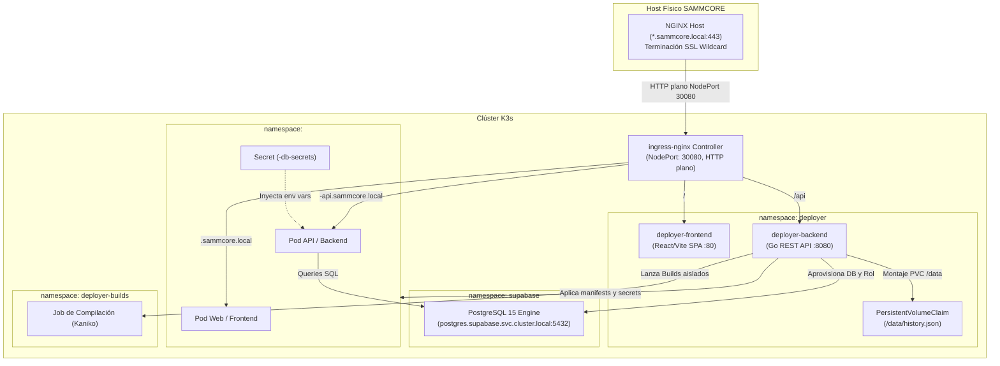

# 📄 Especificación Técnica – SAMMCORE Deployer

## 1. ⚙️ Arquitectura del Sistema

El `sammcore-deployer` opera como una **carga nativa dentro del clúster K3s** en el namespace `deployer`. Se comunica con el API Server de Kubernetes mediante `client-go` (usando el `ServiceAccount` `deployer-sa`) y con la base de datos horizontal de Supabase mediante el driver nativo de PostgreSQL (`lib/pq`).



---

## 2. 📂 Estado Actual vs Estado Objetivo

### Estado Actual en el Repositorio (Hito 4.0 Completado):
* **Backend:**  
  - Prefijo unificado `/api` con middleware de autenticación estricta `Authorization: Bearer <DEPLOYER_API_KEY>` (usando `subtle.ConstantTimeCompare`) y aborto al inicio si no está configurada (salvo `ALLOW_INSECURE_DEV=true`).
  - Eliminación absoluta de alias no autenticados en el router raíz.
  - CORS con lista blanca configurable vía `ALLOWED_ORIGINS` y cabecera `Vary: Origin`.
  - Detección de 3 arquetipos (`compose`, `dockerfile`, `static`) acotada a la raíz del repositorio.
  - Detección real de base de datos en compose (mediante imágenes `postgres`/`mysql` o variables `DB_HOST`).
  - Higiene de disco estricta con `defer os.RemoveAll(rm.Workdir)` en clonado.
  - Persistencia atómica (`.tmp` + `os.Rename`) con exclusión mutua unificada en `DATA_DIR/history.json`.
  - Stubs `501 Not Implemented` en `/api/deploy`, `/api/projects/{id}` (DELETE) y `redeploy` para no emitir falsos éxitos.
  - Pruebas unitarias de router y repo_manager pasando con `go test`.
* **Frontend:**  
  - Consumo de `/api/projects`, captura y almacenamiento de clave API en `localStorage` vía modal en Navbar.
* **Manifiestos K8s:**  
  - `rbac.yaml` corregido con `apiGroup: rbac.authorization.k8s.io`.
  - `backend.yaml` con `strategy: Recreate`, `imagePullPolicy: Always` y límites de `ephemeral-storage`.
  - `pvc.yaml` creado y `secret.example.yaml` aislado en `manifests/examples/`.

### Estado Objetivo (Hitos 4.1 a 4.5):
* `services/db_manager.go`: Conexión administrativa a Supabase PostgreSQL y aprovisionamiento idempotente de 4 casos (Modelo A).
* `services/secret_manager.go`: Creación en memoria de Kubernetes Secrets vía `client-go`.
* `services/template_manager.go`: Renderizado de manifiestos con single-level subdomains (`<proyecto>-api.sammcore.local`) y LimitRange.
* `services/deploy_manager.go`: Orquestador asíncrono que aplica recursos en K3s y reporta estado del rollout.

---

## 3. 📡 Contrato Unificado de la API REST

Todos los endpoints mutables requieren el header `Authorization: Bearer <DEPLOYER_API_KEY>`:

| Método | Endpoint | Código Éxito | Descripción |
| :--- | :--- | :--- | :--- |
| `GET` | `/api/health` | `200 OK` | Liveness y readiness probe (Público) |
| `GET` | `/metrics` | `200 OK` | Métricas Prometheus (Público) |
| `POST` | `/api/analyzeRepo` | `200 OK` | Clona y detecta arquetipo, puertos y BD |
| `POST` | `/api/deploy` | `202 Accepted` | Inicia despliegue asíncrono en K3s (Hito 4.4) |
| `GET` | `/api/projects` | `200 OK` | Catálogo de proyectos registrados |
| `GET` | `/api/projects/:id` | `200 OK` | Estado en vivo de pods, servicios y rollout |
| `GET` | `/api/projects/:id/logs` | `200 OK` | Logs recientes del pod principal |
| `POST` | `/api/projects/:id/redeploy` | `202 Accepted` | Reinicia o re-aplica el despliegue |
| `DELETE` | `/api/projects/:id` | `200 OK` | Destruye namespace y condicionalmente la BD |

### 🔹 Payload de `POST /api/deploy`
```json
{
  "name": "backroom",
  "repo": "https://github.com/a81Biz/backroom",
  "branch": "master",
  "type": "compose",
  "requires_database": true,
  "web_image": "ghcr.io/a81biz/backroom-web:latest",
  "api_image": "ghcr.io/a81biz/backroom-api:latest",
  "web_port": 80,
  "api_port": 8000,
  "build_args": {
    "VITE_API_BASE": "https://backroom-api.sammcore.local"
  }
}
```

### 🔹 Modelo de Error Uniforme
```json
{
  "status": "error",
  "error": "Descripción amigable del error",
  "code": "INVALID_ARGUMENT | UNAUTHORIZED | NOT_FOUND | CONFLICT | NOT_IMPLEMENTED | INTERNAL"
}
```

---

## 4. 🐳 Compilación de Imágenes Aislada (Kaniko)

Para evitar agotar la `ResourceQuota` de la aplicación durante la compilación, los builds in-cluster de Kaniko se ejecutan en un namespace dedicado: `deployer-builds`:
* Cuenta con su propia cuota de compilación (hasta 4 CPU y 4Gi RAM).
* Utiliza el secreto `kaniko-registry-secret` para autenticarse con GHCR.
* Finalizado el build, el pod de Kaniko es purgado automáticamente mediante `ttlSecondsAfterFinished: 120`.
