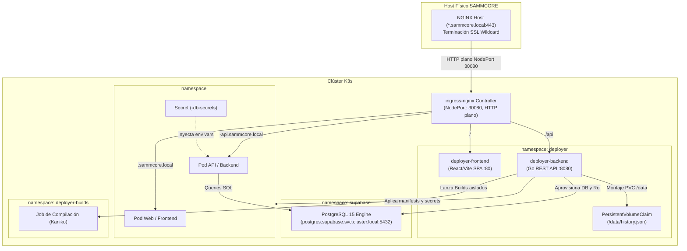

# 📄 Especificación Técnica – SAMMCORE Deployer

## 1. ⚙️ Arquitectura del Sistema

El `sammcore-deployer` opera como una **carga nativa dentro del clúster K3s** en el namespace `deployer`. Se comunica con el API Server de Kubernetes mediante `client-go` (usando el `ServiceAccount` `deployer-sa`) y con la base de datos horizontal de Supabase mediante el driver nativo de PostgreSQL (`lib/pq`).



---

## 2. 📂 Estado Operativo del Sistema (Deployer v2 Consolidado)

El sistema se encuentra **100% implementado, operativo y validado en producción**:
* **Backend:**  
  - Prefijo unificado `/api` con middleware de autenticación estricta `Authorization: Bearer <DEPLOYER_API_KEY>` (usando `subtle.ConstantTimeCompare`) y aborto al inicio si no está configurada.
  - CORS con lista blanca configurable vía `ALLOWED_ORIGINS` y cabecera `Vary: Origin`.
  - **Análisis Per-Service (`DetectServicePlan`):** Parseo estructurado de Compose y Dockerfiles mediante `gopkg.in/yaml.v3`. Detecta y extrae cada servicio con su rol (`web`, `api`, `worker`), puerto real del contenedor (`target`) y directorio de build sin falsos positivos.
  - **Pipeline Kaniko In-Cluster (`build_manager.go`):** Compilación secuencial de imágenes en `deployer-builds` publicando hacia el registro privado local `registry.sammcore-registry.svc.cluster.local:5000`. Caching por commit hash con comprobación de existencia previa para saltar builds innecesarios.
  - **DatabaseManager (`db_manager.go`):** Matriz de idempotencia de 4 casos en PostgreSQL Supabase (Modelo A), preservación de contraseñas vía `DB_PASSWORD`, aislamiento de privilegios y cuota de 20 conexiones.
  - **SecretManager (`secret_manager.go`):** Creación y sincronización de `<proyecto>-db-secrets` y `<proyecto>-env-secrets` en Kubernetes sin persistir secretos en texto plano.
  - **TemplateManager (`template_manager.go`):** Renderizado de Deployments, Services ClusterIP, Ingress dinámico y NetworkPolicy per-service bajo RFC 1123.
  - **DeployManager (`deploy_manager.go`):** Orquestación asíncrona en 4 pasos (`1/4 Recursos`, `2/4 Kaniko`, `3/4 Despliegue`, `4/4 Operativo`), con monitoreo de rollout y captura de motivos de espera en pods.
  - **Logs y Métricas Dinámicos:** Streaming en vivo de logs sanitizados (remoción de escapes ANSI y filtrado de ruido APT) y métricas de CPU/RAM/Quota en tiempo real según la fase del proyecto.
* **Frontend:**  
  - Consumo reactivo de la API, captura de credenciales mediante modal React, tabla dinámica per-service y visualización de progreso en 4 pasos con métricas y logs en vivo.
* **Infraestructura K8s:**  
  - `sammcore-registry` (Docker Registry 2.0 con PVC NVMe 10Gi y NodePort 30500 con espejo en K3s registries.yaml).
  - `deployer-builds` (Namespace con ResourceQuota de 10Gi RAM / 4 CPUs, LimitRange y NetworkPolicy con salida DNS en puerto 53).

---

## 3. 📡 Contrato Unificado de la API REST

Todos los endpoints mutables requieren el header `Authorization: Bearer <DEPLOYER_API_KEY>`:

| Método | Endpoint | Código Éxito | Descripción |
| :--- | :--- | :--- | :--- |
| `GET` | `/api/health` | `200 OK` | Liveness y readiness probe (Público) |
| `GET` | `/metrics` | `200 OK` | Métricas Prometheus del Deployer (Público) |
| `GET` | `/api/metrics` | `200 OK` | Alias de métricas Prometheus del Deployer (Público) |
| `POST` | `/api/analyzeRepo` | `200 OK` | Clona e inspecciona repositorio de forma determinista (Read-Only) |
| `POST` | `/api/deploy` | `202 Accepted` | Inicia despliegue asíncrono en K3s (Hito 4.4) |
| `GET` | `/api/projects` | `200 OK` | Catálogo de proyectos registrados |
| `GET` | `/api/projects/:id` | `200 OK` | Estado en vivo de pods, servicios y rollout |
| `GET` | `/api/projects/:id/logs` | `200 OK` | Logs recientes del pod principal (Hito 4.5) |
| `GET` | `/api/projects/:id/metrics` | `200 OK` | Métricas dinámicas de infraestructura (Pods, CPU, Memoria, Quota) |
| `POST` | `/api/projects/:id/redeploy` | `202 Accepted` | Reinicia o re-aplica el despliegue |
| `DELETE` | `/api/projects/:id` | `200 OK` | Destruye namespace y condicionalmente la BD (`?delete_db=true`) |

### 🔹 Respuesta de Inspección: `POST /api/analyzeRepo` (`AnalyzePlan`)
```json
{
  "status": "ok",
  "id": "a81biz-backroom",
  "name": "backroom",
  "type": "compose",
  "branch": "main",
  "domain": "backroom.sammcore.local",
  "api_domain": "backroom-api.sammcore.local",
  "requires_database": true,
  "detected_ports": [80, 8080],
  "services": [
    {
      "name": "backend",
      "role": "api",
      "port": 8080,
      "build_context": "./backend",
      "dockerfile": "Dockerfile"
    },
    {
      "name": "frontend",
      "role": "web",
      "port": 80,
      "build_context": "./frontend",
      "dockerfile": "Dockerfile"
    },
    {
      "name": "worker",
      "role": "worker",
      "build_context": "./worker",
      "dockerfile": "Dockerfile"
    }
  ],
  "evidence": ["docker-compose.yml"]
}
```

### 🔹 Payload de Solicitud de Despliegue: `POST /api/deploy`
```json
{
  "name": "backroom",
  "repo": "https://github.com/a81Biz/backroom",
  "branch": "main",
  "type": "compose",
  "requires_database": true,
  "services": [
    {
      "name": "backend",
      "role": "api",
      "port": 8080,
      "build_context": "./backend",
      "dockerfile": "Dockerfile"
    },
    {
      "name": "frontend",
      "role": "web",
      "port": 80,
      "build_context": "./frontend",
      "dockerfile": "Dockerfile"
    },
    {
      "name": "worker",
      "role": "worker",
      "build_context": "./worker",
      "dockerfile": "Dockerfile"
    }
  ],
  "env": {
    "VITE_API_BASE": "https://backroom-api.sammcore.local"
  }
}
```

### 🔹 Modelo de Error Uniforme
```json
{
  "status": "error",
  "error": "Descripción amigable del error",
  "code": "INVALID_ARGUMENT | UNAUTHORIZED | NOT_FOUND | CONFLICT | NOT_IMPLEMENTED | INTERNAL"
}
```

---

## 4. 🐳 Compilación de Imágenes Aislada (Kaniko) y Registry Local

Para garantizar la autonomía total del clúster sin depender de servicios externos de CI/CD ni registros públicos externos:
* **Namespace Dedicado:** Los builds se ejecutan en `deployer-builds` con `ResourceQuota` de 10Gi RAM / 4 CPUs y `NetworkPolicy` que autoriza salida al puerto 53 (DNS UDP/TCP).
* **Docker Registry Local:** Se ejecuta en el namespace `sammcore-registry` (`registry:2`, PVC de 10Gi NVMe) accesible internamente en `registry.sammcore-registry.svc.cluster.local:5000` y vía NodePort `30500` con mirror en `/etc/rancher/k3s/registries.yaml`.
* **Optimización y Estabilidad:**
  - Pods de Kaniko con límite de memoria de **7.5 GiB** (requests 1 GiB) para compilar sin saturación dependencias pesadas de ML (PyTorch/Torchvision).
  - Flags de alto rendimiento: `--compressed-caching=false` y `--snapshot-mode=redo`.
  - Compilación secuencial por servicio (`backend` $\rightarrow$ `frontend` $\rightarrow$ `worker`) para evitar picos de memoria en el nodo.
  - Comprobación de caché de manifiestos en el registry para reusar imágenes en 0s si el commit no ha cambiado.
* **Logs Sanitizados en Vivo:** Durante el estado `building_image`, el endpoint `/api/projects/:id/logs` remueve códigos ANSI (`\x1b[...]`) y filtra trazas irrelevantes de paquetes, permitiendo supervisar el build en tiempo real.

---

## Seguridad y Configuración Central

### config/config.go — Configuración unificada

Toda la configuración del deployer se centraliza en `backend/config/config.go`:

| Variable de entorno | Default | Descripción |
|---------------------|---------|-------------|
| `BASE_DOMAIN` | `sammcore.local` | Dominio base del clúster |
| `BUILDS_NAMESPACE` | `deployer-builds` | Namespace para Jobs Kaniko |
| `REGISTRY_URL` | `registry.sammcore-registry.svc.cluster.local:5000` | Registry interno |
| `DB_APP_HOST` | `postgres.supabase.svc.cluster.local` | Host de BD para apps |
| `INGRESS_CLASS` | `nginx` | Clase de Ingress |
| `GIT_IMAGE` | `alpine/git:2.43.0` | Imagen git (versión fija) |
| `KANIKO_IMAGE` | `gcr.io/kaniko-project/executor:v1.23.2` | Imagen Kaniko (versión fija) |
| `BUILD_TIMEOUT_SEC` | `900` | Timeout build en segundos |
| `ROLLOUT_TIMEOUT_SEC` | `300` | Timeout rollout en segundos |
| `QUOTA_REQUEST_CPU` | `500m` | Piso de CPU garantizado para el namespace del proyecto |
| `QUOTA_REQUEST_MEM` | `512Mi` | Piso de RAM garantizado para el namespace del proyecto |
| `QUOTA_LIMIT_CPU` | `4000m` | Techo de ráfaga de CPU por namespace (hasta 4 cores) |
| `QUOTA_LIMIT_MEM` | `3Gi` | Techo de ráfaga de RAM por namespace (bolsa compartida) |
| `QUOTA_MAX_PODS` | `10` | Máximo de pods por namespace |

### Dimensionamiento Dinámico y Elasticidad por Rol

Para evitar el bloqueo de capacidad por sobre-aprovisionamiento estático y al mismo tiempo impedir caídas por `OOMKilled` en cargas pesadas (ej. workers con PyTorch, Ultralytics u OpenCV), el deployer opera bajo el modelo **QoS Burstable**:

* **Piso mínimo de reserva (`requests`)**:
  * Cada pod solicita un piso casi testimonial en reposo (10m-20m CPU, 16Mi-64Mi RAM).
  * Un proyecto estándar de 3 pods (Web + API + Worker) solo aparta **112 MiB de RAM** y **50m CPU** del clúster en reposo. Esto permite desplegar decenas de sitios o proyectos piloto simultáneos en el servidor sin agotar la capacidad ante el scheduler.
* **Techo de ráfaga elástica (`limits` por rol)**:
  * **`web`**: req `10m`/`16Mi`, limit `250m`/`128Mi`.
  * **`api`**: req `20m`/`32Mi`, limit `1000m`/`512Mi` (aceleración instantánea ante picos de tráfico).
  * **`worker`**: req `20m`/`64Mi`, limit `2000m`/`1536Mi` (2 cores y 1.5 GiB de techo para OCR/visión artificial).
* **Bolsa Compartida por Namespace (`ResourceQuota`)**:
  * El namespace tiene un techo global (3 GiB RAM / 4 cores) que se comparte dinámicamente entre todos los pods del proyecto. Si los pods Web y API están en reposo (ej. 8 MiB juntos), el Worker dispone de prácticamente todo el presupuesto del proyecto sin provocar contención. Al terminar la tarea pesada, el servidor físico recupera la memoria libre para otros desarrollos.

### Token de GitHub — env var, no URL

El token de acceso a repositorios privados se pasa como variable de entorno `GIT_TOKEN` al initContainer `git-clone`. No se embebe en la URL ni en argumentos de comandos shell. El patrón seguro en el Job de Kaniko:

```yaml
env:
  - name: GIT_TOKEN
    value: "<token>"  # en producción desde Secret K8s
  - name: REPO_HOST
    value: "github.com/org/repo"
  - name: COMMIT_SHA
    value: "<commit-hash>"
```

### Project.EnvKeys — valores nunca en disco

El campo `Env map[string]string` del struct `Project` fue renombrado a `EnvKeys []string`. Solo se persisten los **nombres** de las claves de entorno. Los **valores** viven exclusivamente en el Secret K8s `<proyecto>-env-secrets`.
