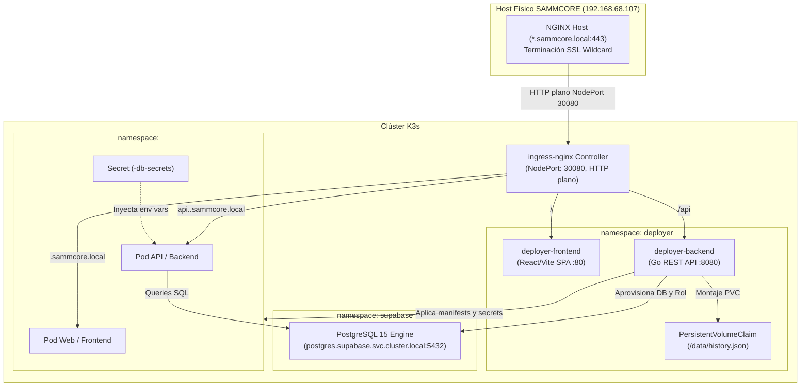

# 📄 Especificación Técnica – SAMMCORE Deployer

## 1. ⚙️ Arquitectura del Sistema

El `sammcore-deployer` opera como una **carga nativa dentro del clúster K3s** en el namespace `deployer`. Se comunica con el API Server de Kubernetes mediante `client-go` y con la base de datos horizontal de Supabase mediante el driver nativo de PostgreSQL (`pgx` / `database/sql`).



---

## 2. 📂 Estado Actual vs Estado Objetivo

### Estado Actual en el Repositorio:
* **Backend:** Implementado `main.go`, `api/router.go`, `core/analyzer.go`, `services/repo_manager.go`, `storage/store.go`.
* **Frontend:** Implementado en React/Vite (`RegistrarProyecto.tsx`, `EstadoProyectos.tsx`, `services/api.ts`).
* **CI/CD:** Workflow `test.yml` y `deploy.yml` agregados; Dockerfiles multi-stage creados.

### Estado Objetivo (Fase 4):
* `services/db_manager.go`: Conexión administrativa a Supabase PostgreSQL y aprovisionamiento idempotente del Modelo A.
* `services/secret_manager.go`: Creación en memoria de Kubernetes Secrets vía `client-go`.
* `services/template_manager.go`: Motor de renderizado de manifiestos K8s para los 3 arquetipos (`compose`, `dockerfile`, `static`).
* `services/deploy_manager.go`: Orquestador que aplica recursos en K3s y monitorea el estado del rollout.

---

## 3. 📡 Contrato Unificado de la API REST

Todos los endpoints exponen el prefijo `/api` y requieren el header `Authorization: Bearer <DEPLOYER_API_KEY>` para operaciones de escritura:

| Método | Endpoint | Descripción | Parámetros / Body |
| :--- | :--- | :--- | :--- |
| `GET` | `/api/health` | Verificación de liveness / readiness | Ninguno |
| `GET` | `/metrics` | Métricas en formato Prometheus | Ninguno |
| `POST` | `/api/analyzeRepo` | Clona en temporal, analiza y retorna arquetipo | `{"repo": "...", "branch": "..."}` |
| `POST` | `/api/deploy` | Aprovisiona BD, genera manifests y aplica en K3s | `{"id": "...", "repo": "...", "branch": "...", "type": "...", "requires_database": bool}` |
| `GET` | `/api/projects` | Lista el catálogo de proyectos y su estado | Ninguno |
| `GET` | `/api/projects/:id` | Consulta estado en vivo de pods, servicios e Ingress | `id` en URL |
| `GET` | `/api/projects/:id/logs` | Retorna los logs recientes del pod del proyecto | `id` en URL |
| `POST` | `/api/projects/:id/redeploy` | Reinicia o re-aplica el despliegue | `id` en URL |
| `DELETE` | `/api/projects/:id` | Elimina namespace K8s y opcionalmente la BD | Query param `?delete_db=true\|false` |

---

## 4. 🧩 Especificación de Módulos del Backend

### 🔹 4.1. `RepoManager` (`services/repo_manager.go`)
* Clona mediante `go-git` de forma superficial (`depth: 1`) en un directorio temporal (`/tmp/sammcore-deployer-*`).
* **Higiene:** Toda invocación debe ejecutar `defer os.RemoveAll(workdir)` inmediatamente después de completar el análisis para evitar saturación de disco.
* Detecta:
  - `ProjectCompose`: Presencia de `docker-compose.yml` o `docker-compose.yaml`.
  - `ProjectDockerfile`: Presencia de `Dockerfile`.
  - `ProjectStatic`: Presencia de `index.html`, o `package.json` con scripts de build estático sin backend server.
  - `ProjectUnknown`: Ninguno de los anteriores.

### 🔹 4.2. `DatabaseManager` (`services/db_manager.go`)
* Gestiona el ciclo de vida en PostgreSQL central (`postgres.supabase.svc.cluster.local:5432`).
* Detallado en `docs/05-database-model-a.md`.

### 🔹 4.3. `SecretManager` (`services/secret_manager.go`)
* Si el Secret `<proyecto>-db-secrets` ya existe en K8s, **recupera y reutiliza la contraseña existente** para garantizar idempotencia en re-despliegues.
* Si no existe, genera una cadena criptográfica de 32 caracteres y crea el objeto `Secret` en Kubernetes usando `client-go`.
* Cero contraseñas en texto plano en Git o disco.

### 🔹 4.4. `TemplateManager` (`services/template_manager.go`)
* Selecciona la plantilla adecuada (`compose-multi-service`, `single-dockerfile`, `static-web`).
* Inyecta variables sanitizadas: nombres conformes a RFC 1123, puertos y subdominios dinámicos.

### 🔹 4.5. `DeployManager` (`services/deploy_manager.go`)
* Aplica el manifiesto unificado en K3s mediante la interfaz dinámica de `client-go`.
* Inyecta en cada namespace:
  - `ResourceQuota` (Límite: 2 CPU, 2Gi RAM).
  - `NetworkPolicy` (Aislamiento de tráfico).
  - `Deployments`, `Services`, `Ingress` y `Secrets`.

---

## 5. 🐳 Estrategia de Compilación de Imágenes (K3s con containerd)

Como K3s no expone el socket de Docker (`/var/run/docker.sock`), se establecen dos vías:
1. **Vía Principal (GitOps / CI en el repo cliente):**  
   El repositorio de la aplicación cliente compila su imagen en su propio GitHub Actions y la publica en GHCR (`ghcr.io/org/repo:tag`). El Deployer recibe la referencia de la imagen y la despliega inyectando un `imagePullSecrets` global.
2. **Vía In-Cluster (Kaniko Job):**  
   Si el proyecto requiere build local dentro del clúster, `DeployManager` lanza un **Job de Kaniko** (`gcr.io/kaniko-project/executor:v1.23.0`). Kaniko compila el Dockerfile dentro de un contenedor sin privilegios de root ni daemon de Docker, empuja al registro y finaliza.

---

## 6. 💾 Persistencia y Almacenamiento
* El historial de proyectos (`history.json`) se almacena en el directorio montado `/data`, respaldado por un `PersistentVolumeClaim` con `storageClassName: local-path`.
* El struct de persistencia se amplía:
```go
type ProjectStatus string
const (
    StatusAnalyzed     ProjectStatus = "analyzed"
    StatusProvisioning ProjectStatus = "provisioning_db"
    StatusBuilding     ProjectStatus = "building_image"
    StatusDeploying    ProjectStatus = "deploying_k8s"
    StatusRunning      ProjectStatus = "running"
    StatusFailed       ProjectStatus = "failed"
)

type Project struct {
    ID               string        `json:"id"`
    Name             string        `json:"name"`
    Repo             string        `json:"repo"`
    Branch           string        `json:"branch"`
    Type             string        `json:"type"`
    Namespace        string        `json:"namespace"`
    Domain           string        `json:"domain"`
    APIDomain        string        `json:"api_domain,omitempty"`
    RequiresDatabase bool          `json:"requires_database"`
    Status           ProjectStatus `json:"status"`
    CreatedAt        time.Time     `json:"created_at"`
    UpdatedAt        time.Time     `json:"updated_at"`
}
```
