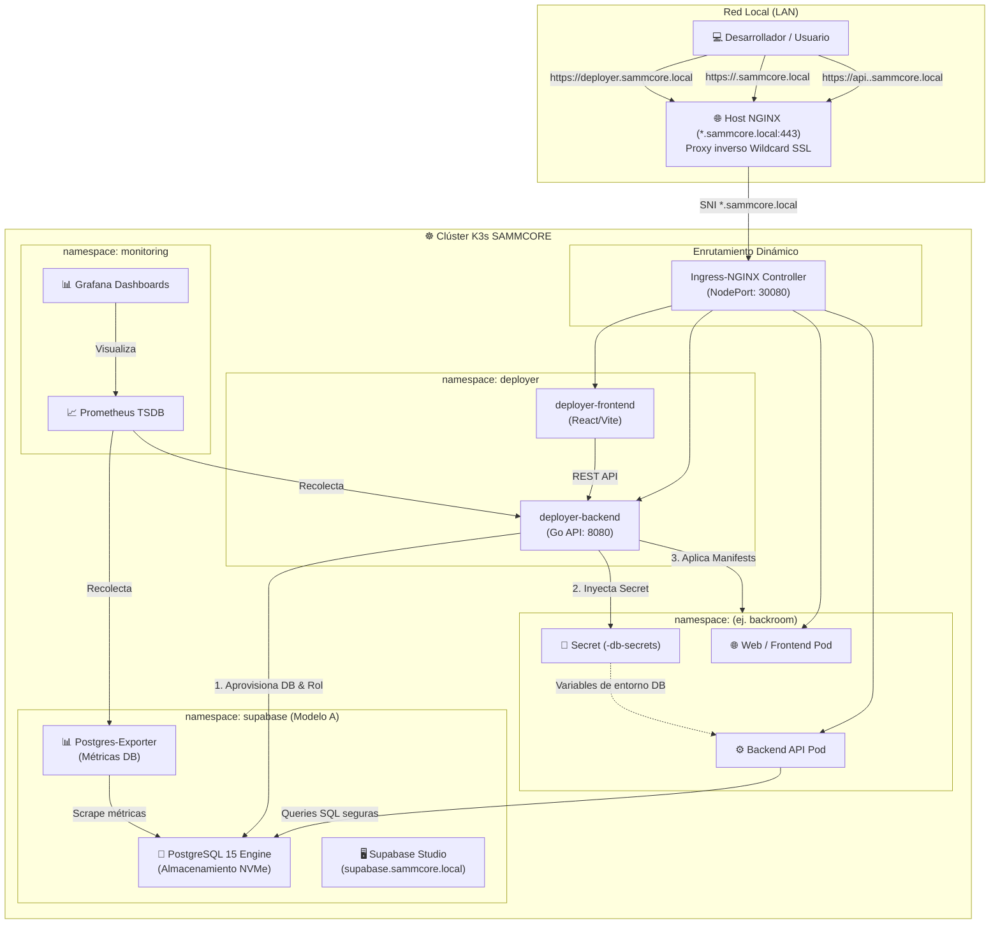

# 📄 Arquitectura Fase 4 — SAMMCORE-Deployer

## 1. Rol del Deployer

* **Orquestador central de despliegues nativo en Kubernetes.**  
  Se encarga de:
  1. Detectar y analizar repositorios de GitHub (push, webhook, release o solicitud manual desde la UI).
  2. Aprovisionar automáticamente bases de datos dedicadas en el clúster central de Supabase (**Modelo A**).
  3. Crear **Kubernetes Secrets** en memoria con las credenciales de conexión (cero contraseñas en texto plano en Git o disco).
  4. Generar y aplicar manifiestos de Kubernetes (`Namespace`, `Deployment`, `Service`, `Ingress`, `Secret`).
  5. Configurar el enrutamiento dinámico de subdominios (`sitio.sammcore.local`, `api.sitio.sammcore.local`) a través de `ingress-nginx`.
  6. Registrar el histórico de despliegues y exponer métricas a Prometheus y Grafana.

* **Ubicación en el clúster:**  
  Corre como una **carga de trabajo de primera clase dentro del clúster K3s** (`namespace: deployer`), formando parte integral de la suite SAMMCORE junto con Supabase (`namespace: supabase`), Monitoreo (`namespace: monitoring`) y el Ingress Controller (`namespace: ingress-nginx`).
  - Permite acceso nativo mediante red interna `cluster.local` sin exponer puertos administrativos al exterior.
  - La comunicación con el API server de K8s se realiza de forma segura mediante RBAC / ServiceAccount / Kubeconfig interno.
  - Se visualiza y administra desde el Kubernetes Dashboard y Grafana.

---

## 2. Relación con el ecosistema SAMMCORE

* **Supabase (`namespace: supabase`):**  
  Plataforma central de datos PostgreSQL 15. El Deployer interactúa internamente vía `postgres.supabase.svc.cluster.local:5432` aprovisionando esquemas y usuarios por proyecto (Modelo A), administrables visualmente desde Supabase Studio (`https://supabase.sammcore.local`).
* **Ingress-NGINX Controller (`namespace: ingress-nginx`):**  
  Recibe el tráfico enrutado dinámicamente desde el NGINX del host (vía NodePort `30080` y wildcard `*.sammcore.local`). Cada nuevo Ingress creado por el deployer entra en funcionamiento de inmediato sin reiniciar servicios.
* **Grafana & Prometheus (`namespace: monitoring`):**  
  Prometheus recolecta métricas del Deployer (`/metrics`), del clúster K3s y de las bases de datos de Supabase vía `postgres-exporter`.
* **Portainer & Kubernetes Dashboard:**  
  Permiten inspeccionar el estado de los pods, servicios y volúmenes de cada proyecto desplegado.

---

## 3. Diagrama de arquitectura

---

## 4. Flujo de trabajo integral

1. **Registro / Trigger:** El desarrollador ingresa a `https://deployer.sammcore.local`, proporciona el repositorio (ej. `https://github.com/a81Biz/backroom`) y selecciona la rama.
2. **Análisis (`POST /analyzeRepo`):**
   - El backend clona el repo en memoria/espacio temporal.
   - Detecta la naturaleza del proyecto (`compose`, `dockerfile`, `static`).
   - Identifica si requiere base de datos y puertos de frontend/backend.
3. **Aprovisionamiento de Base de Datos (Supabase Modelo A):**
   - `DatabaseManager` se conecta a PostgreSQL central.
   - Crea de forma idempotente `<proyecto>_db` y el usuario `<proyecto>_user` con contraseña criptográfica.
   - Restringe permisos para aislamiento absoluto.
4. **Gestión de Secretos en Memoria:**
   - `SecretManager` toma las credenciales generadas y crea el objeto `Secret` en Kubernetes (`<proyecto>-db-secrets`).
   - Ninguna credencial se escribe en disco ni se versiona en Git.
5. **Generación de Manifiestos y Subdominios:**
   - `TemplateManager` ensambla los recursos de K8s:
     - `Namespace: <proyecto>`
     - `Deployments` para cada servicio.
     - `Services` de tipo `ClusterIP`.
     - `Ingress` asociando:
       - `<proyecto>.sammcore.local` -> Servicio Web
       - `api.<proyecto>.sammcore.local` -> Servicio API Backend
6. **Aplicación en Clúster (`client-go`):**
   - `DeployManager` aplica los manifiestos al clúster K3s.
7. **Monitoreo y Verificación:**
   - Pods inician y consumen el `Secret` de BD.
   - La nueva base aparece en Supabase Studio.
   - Métricas de tráfico y conexiones se reflejan en Prometheus y Grafana.

---

## 5. Seguridad y Gobernanza

* **Cero Contraseñas en Texto Plano:** Todo parámetro sensible reside únicamente en Kubernetes Secrets inyectados como variables de entorno.
* **Aislamiento Multi-Tenant:** Cada proyecto posee su propio `Namespace` de K8s y su propia base y usuario en PostgreSQL.
* **Enrutamiento Dinámico Total:** La adición o eliminación de proyectos no requiere modificar el NGINX del host físico ni reiniciar servicios.
